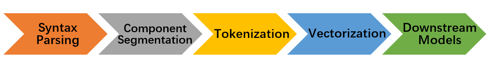

Get Started
===============

*  `Standard Item Format <sif.rst>`_

*  `Syntax Parsing <parse.rst>`_

*  `Component Segmentation <seg.rst>`_

*  `Tokenization <tokenize.rst>`_

*  `Pre-training <pretrain.rst>`_

*  `Vectorization <vectorization.rst>`_

Main process
---------------

* `Syntax Parsing <parse.rst>`_ : Its function is to convert the incoming item into SIF format, which means letters and numbers should be between ``$...$`` and the brackets and underlines of the choice questions should be converted to special symbols we defined in SIF)

* `Component Segmentation <seg.rst>`_ : Its function is to segment items in SIF format according to the types of items, so as to serve the later tokenization module.(that is, elements in different types can be tokenized using their corresponding methods)。

* `Tokenization <tokenize.rst>`_: Its function is to tokenize segmented items, so as to serve the later tokenization module.
  Generally, the tokenization method in the text form can be used directly. For formulas, the ast method can also be used for parsing(call the formula module).

* `Vectorization <vectorization.rst>`_: This part mainly calls I2V class and its subclasses. Its function is to vectorize the list of tokenized items, so as to get the corresponding static vectors.
  For vectorization module, You can call your own trained model or directly call the provided pre-training model(call get_pretrained_I2V module).

* **Downstream Model**：Process the obtained vectors to get the desired results.

Examples
---------

To help you quickly understand the functions of this project, this section only shows the usages of common function interface. Intermediate function modules (such as parse, formula, segment, etc.) and more subdivided interface methods are not shown. For further study, please refer to relevant documents.

.. nbgallery::
    :caption: This is a thumbnail gallery:
    :name: tokenize_gallery
    :glob:
    
    Tokenization  <../../build/blitz/tokenizer/tokenizer.ipynb>

.. nbgallery::
    :caption: This is a thumbnail gallery:
    :name: vectorization_gallery
    :glob:
    
    Vectorization  <../../build/blitz/vectorization/total_vector.ipynb>
