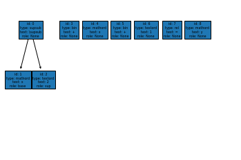
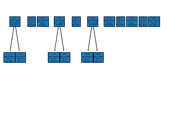

Formula syntax structure parsing
----------------------------------

This section is mainly realized by EduNLP. Formula modules, which can determine if the text has syntax errors and convert the syntax formula into the form of ast tree. In practice, this module is often used as part of an intermediate process, and the relevant parameters of this module can be automatically chosen by calling the corresponding model, so it generally does not need special attention.

Introduction of Main Content
+++++++++++++++++++++++++++++++++++++

1.Formula: determine whether the single formula passed in is in str form. If so, use the ast method for processing, otherwise an error will be reported. In addition, parameter variable_standardization is given. If this parameter is true, the variable standardization method will be used to make sure the same variable has the same variable number.

2.FormulaGroup: If you need to pass in a formula set, you can call this interface to get an ast forest. The tree structure in the forest is the same as that of Formula.

Formula
>>>>>>>>>>>>

Formula: firstly, in the word segmentation function, the formula of the original text is segmented. In addition, ``Formula parse tree`` function is provided, which can represent the abstract syntax analysis tree of mathematical formula in the form of text or picture.

This module also provides the function of formula variable standardization, such as determining  whether 'x' in several sub formulas is the same variable.

Initialization
++++++++++++++++++++

Incoming parameters: item

Item is the latex formula or the abstract syntax parse tree generated after the formula is parsed and its type is str or List[Dict].

::

   >>> f=Formula("x^2 + x+1 = y")
   >>> f
   <Formula: x^2 + x+1 = y>

View the specific content after formula segmentation
+++++++++++++++++++++++++++++++++++++++++++++++++++++++++++++

- View node elements after formula segmentation

::

   >>> f.elements
   [{'id': 0, 'type': 'supsub', 'text': '\\supsub', 'role': None},
   {'id': 1, 'type': 'mathord', 'text': 'x', 'role': 'base'},
   {'id': 2, 'type': 'textord', 'text': '2', 'role': 'sup'},
   {'id': 3, 'type': 'bin', 'text': '+', 'role': None},
   {'id': 4, 'type': 'mathord', 'text': 'x', 'role': None},
   {'id': 5, 'type': 'bin', 'text': '+', 'role': None},
   {'id': 6, 'type': 'textord', 'text': '1', 'role': None},
   {'id': 7, 'type': 'rel', 'text': '=', 'role': None},
   {'id': 8, 'type': 'mathord', 'text': 'y', 'role': None}]

- View the abstract parsing tree of formulas

::

   >>> f.ast
   [{'val': {'id': 0, 'type': 'supsub', 'text': '\\supsub', 'role': None},
   'structure': {'bro': [None, 3],'child': [1, 2],'father': None,'forest': None}},
   {'val': {'id': 1, 'type': 'mathord', 'text': 'x', 'role': 'base'},
   'structure': {'bro': [None, 2], 'child': None, 'father': 0, 'forest': None}},
   {'val': {'id': 2, 'type': 'textord', 'text': '2', 'role': 'sup'},
   'structure': {'bro': [1, None], 'child': None, 'father': 0, 'forest': None}},
   {'val': {'id': 3, 'type': 'bin', 'text': '+', 'role': None},
   'structure': {'bro': [0, 4], 'child': None, 'father': None, 'forest': None}},
   {'val': {'id': 4, 'type': 'mathord', 'text': 'x', 'role': None},
   'structure': {'bro': [3, 5], 'child': None, 'father': None, 'forest': None}},
   {'val': {'id': 5, 'type': 'bin', 'text': '+', 'role': None},
   'structure': {'bro': [4, 6], 'child': None, 'father': None, 'forest': None}},
   {'val': {'id': 6, 'type': 'textord', 'text': '1', 'role': None},
   'structure': {'bro': [5, 7], 'child': None, 'father': None, 'forest': None}},
   {'val': {'id': 7, 'type': 'rel', 'text': '=', 'role': None},
   'structure': {'bro': [6, 8], 'child': None, 'father': None, 'forest': None}},
   {'val': {'id': 8, 'type': 'mathord', 'text': 'y', 'role': None},
   'structure': {'bro': [7, None],'child': None,'father': None,'forest': None}}]

   >>> print('nodes: ',f.ast_graph.nodes)
   nodes:  [0, 1, 2, 3, 4, 5, 6, 7, 8]
   >>> print('edges: ' ,f.ast_graph.edges)
   edges:  [(0, 1), (0, 2)]

- show the abstract parse tree by a picture

::

   >>> ForestPlotter().export(f.ast_graph, root_list=[node["val"]["id"] for node in f.ast if node["structure"]["father"] is None],)
   >>> plt.show()

Variable Standardization
+++++++++++++++++++++++++++++++++

This parameter makes the same variable have the same variable number.

For example: the number of variable ``x`` is ``0`` and the number of variable ``y`` is ``1``.

::

   >>> f.variable_standardization().elements
   [{'id': 0, 'type': 'supsub', 'text': '\\supsub', 'role': None},
   {'id': 1, 'type': 'mathord', 'text': 'x', 'role': 'base', 'var': 0},
   {'id': 2, 'type': 'textord', 'text': '2', 'role': 'sup'},
   {'id': 3, 'type': 'bin', 'text': '+', 'role': None},
   {'id': 4, 'type': 'mathord', 'text': 'x', 'role': None, 'var': 0},
   {'id': 5, 'type': 'bin', 'text': '+', 'role': None},
   {'id': 6, 'type': 'textord', 'text': '1', 'role': None},
   {'id': 7, 'type': 'rel', 'text': '=', 'role': None},
   {'id': 8, 'type': 'mathord', 'text': 'y', 'role': None, 'var': 1}]

FormulaGroup
>>>>>>>>>>>>>>>

Call ``FormulaGroup`` class to parse the equations. The related attributes and functions are the same as those above.

::

   >>> fs = FormulaGroup(["x^2 = y", "x^3 = y^2", "x + y = \pi"])
   >>> fs
   <FormulaGroup: <Formula: x^2 = y>;<Formula: x^3 = y^2>;<Formula: x + y = \pi>>
   >>> fs.elements
   [{'id': 0, 'type': 'supsub', 'text': '\\supsub', 'role': None},
   {'id': 1, 'type': 'mathord', 'text': 'x', 'role': 'base'},
   {'id': 2, 'type': 'textord', 'text': '2', 'role': 'sup'},
   {'id': 3, 'type': 'rel', 'text': '=', 'role': None},
   {'id': 4, 'type': 'mathord', 'text': 'y', 'role': None},
   {'id': 5, 'type': 'supsub', 'text': '\\supsub', 'role': None},
   {'id': 6, 'type': 'mathord', 'text': 'x', 'role': 'base'},
   {'id': 7, 'type': 'textord', 'text': '3', 'role': 'sup'},
   {'id': 8, 'type': 'rel', 'text': '=', 'role': None},
   {'id': 9, 'type': 'supsub', 'text': '\\supsub', 'role': None},
   {'id': 10, 'type': 'mathord', 'text': 'y', 'role': 'base'},
   {'id': 11, 'type': 'textord', 'text': '2', 'role': 'sup'},
   {'id': 12, 'type': 'mathord', 'text': 'x', 'role': None},
   {'id': 13, 'type': 'bin', 'text': '+', 'role': None},
   {'id': 14, 'type': 'mathord', 'text': 'y', 'role': None},
   {'id': 15, 'type': 'rel', 'text': '=', 'role': None},
   {'id': 16, 'type': 'mathord', 'text': '\\pi', 'role': None}]
   >>> fs.ast
   [{'val': {'id': 0, 'type': 'supsub', 'text': '\\supsub', 'role': None},
   'structure': {'bro': [None, 3],
      'child': [1, 2],
      'father': None,
      'forest': None}},
   {'val': {'id': 1, 'type': 'mathord', 'text': 'x', 'role': 'base'},
   'structure': {'bro': [None, 2],
      'child': None,
      'father': 0,
      'forest': [6, 12]}},
   {'val': {'id': 2, 'type': 'textord', 'text': '2', 'role': 'sup'},
   'structure': {'bro': [1, None], 'child': None, 'father': 0, 'forest': None}},
   {'val': {'id': 3, 'type': 'rel', 'text': '=', 'role': None},
   'structure': {'bro': [0, 4], 'child': None, 'father': None, 'forest': None}},
   {'val': {'id': 4, 'type': 'mathord', 'text': 'y', 'role': None},
   'structure': {'bro': [3, None],
      'child': None,
      'father': None,
      'forest': [10, 14]}},
   {'val': {'id': 5, 'type': 'supsub', 'text': '\\supsub', 'role': None},
   'structure': {'bro': [None, 8],
      'child': [6, 7],
      'father': None,
      'forest': None}},
   {'val': {'id': 6, 'type': 'mathord', 'text': 'x', 'role': 'base'},
   show more (open the raw output data in a text editor) ...
   >>> fs.variable_standardization()[0]
   [{'id': 0, 'type': 'supsub', 'text': '\\supsub', 'role': None}, {'id': 1, 'type': 'mathord', 'text': 'x', 'role': 'base', 'var': 0}, {'id': 2, 'type': 'textord', 'text': '2', 'role': 'sup'}, {'id': 3, 'type': 'rel', 'text': '=', 'role': None}, {'id': 4, 'type': 'mathord', 'text': 'y', 'role': None, 'var': 1}]
   >>> ForestPlotter().export(fs.ast_graph, root_list=[node["val"]["id"] for node in fs.ast if node["structure"]["father"] is None],)

