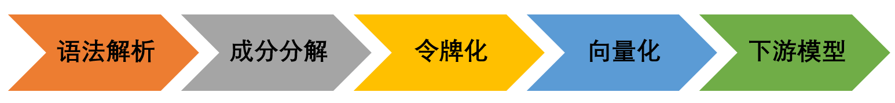

入门
=====

*  `标准项目格式 <sif.rst>`_ 

*  `语法解析 <parse.rst>`_ 

*  `成分分解 <seg.rst>`_ 

*  `令牌化 <tokenize.rst>`_ 

*  `预训练 <pretrain.rst>`_ 

*  `向量化 <vectorization.rst>`_ 

主要流程
----------

* `语法解析 <parse.rst>`_ ：其作用是将传入的item转换为标准sif格式（即把字母、数字用 ``$...$`` 包裹起来，把选择填空的括号、下划线转换为特殊符号等）。

* `成分分解 <seg.rst>`_ ：其作用是将传入的符合sif标准的item根据元素种类进行分割开来，从而服务于后面的令牌化环节（即可以将不同类型元素使用各自的方法令牌化）。

* `令牌化 <tokenize.rst>`_：其作用是将传入的经过分词后的item元素列表进行令牌化分解，从而服务于后面的向量化模块。
  其中通常情况下直接使用文本形式的令牌化方法即可，对于公式而言还可使用ast方法进行解析(调用formula模块)；

* `向量化 <vectorization.rst>`_：此部分主要调用的是I2V类及其子类，其作用是将传入的令牌化后的item元素列表进行向量化操作，最终即可得到相应的静态向量。
  对于向量化模块来说，可以调用自己训练好的模型，也可直接调用提供的预训练模型（调用get_pretrained_i2v模块即可）。

* **下游模型**：将得到的向量进一步处理，从而得到所需的结果。

示例
--------

为使您快速了解此项目的功能，此部分仅展示常用的函数接口使用方法（如得到令牌化序列、试题对应的向量等），对于其中间函数模块（如parse、formula、segment等）以及更细分的接口方法不做展示，如需深入学习，请查看相关部分的文档。

.. nbgallery::
    :caption: This is a thumbnail gallery:
    :name: tokenize_gallery
    :glob:
    
    令牌化  <../../build/blitz/tokenizer/tokenizer.ipynb>

.. nbgallery::
    :caption: This is a thumbnail gallery:
    :name: vectorization_gallery
    :glob:
    
    向量化  <../../build/blitz/vectorization/total_vector.ipynb>
