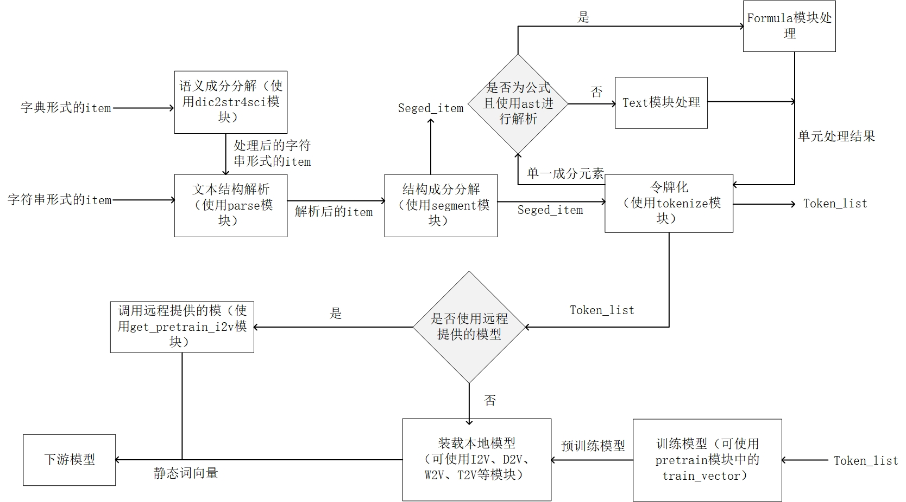

入门
=====

*  `标准项目格式 <sif.rst>`_ 

*  `语法解析 <seg.rst>`_ 

*  `成分分解 <parse.rst>`_ 

*  `令牌化 <tokenize.rst>`_ 

*  `预训练 <pretrain.rst>`_ 

*  `向量化 <vectorization.rst>`_ 

主要流程
----------

示例
--------

为使您快速了解此项目的功能，此部分仅展示常用的函数接口使用方法（如得到令牌化序列、试题对应的向量等），对于其中间函数模块（如parse、formula、segment等）以及更细分的接口方法不做展示，如需深入学习，请查看相关部分的文档。

令牌化
^^^^^^^^^^^

.. nbgallery::
    :caption: This is a thumbnail gallery:
    :name: tokenizer_gallery
    :glob:
    
    直接使用tokenize模块来进行令牌化  <../../build/blitz/tokenizer/tokenizer.ipynb>
    调用已经封装好的令牌化容器进行令牌化  <../../build/blitz/tokenizer/tokenizier.ipynb>
    调用sif4sci来进行令牌化 <../../build/blitz/sif/sif4sci.ipynb>

向量化
^^^^^^^^^^^

.. nbgallery::
    :caption: This is a thumbnail gallery:
    :name: vectorization_gallery
    :glob:
    
    获得数据集  <../../build/blitz/pretrain/prepare_dataset.ipynb>
    调用已有模型得到对应的向量  <../../build/blitz/vectorization/i2v.ipynb>
    直接利用提供的预训练模型得到对应向量  <../../build/blitz/vectorization/get_pretrained_i2v.ipynb>
